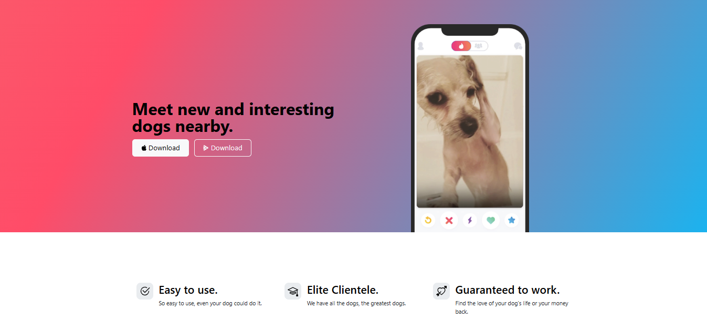

# 🐶 TinDog Project
A responsive landing page for a fictional startup that connects dog owners and their pets for social interaction. Built using HTML, CSS, and Bootstrap, this project showcases front-end development skills, mobile-first design principles, and clean, scalable UI layout techniques.

---

## 🔍 Preview

 

[🔗 Live Demo](https://abdullahlko.github.io/tindog-project/) 

---

## 🚀 Features

- ✅ Responsive design for desktop, tablet, and mobile
- ✅ Bootstrap-powered grid system and components
- ✅ Modern and intuitive UI layout
- ✅ Clean, well-commented, and maintainable code

---

## 🛠️ Built With

- HTML5
- CSS3
- [Bootstrap 5](https://getbootstrap.com/)

